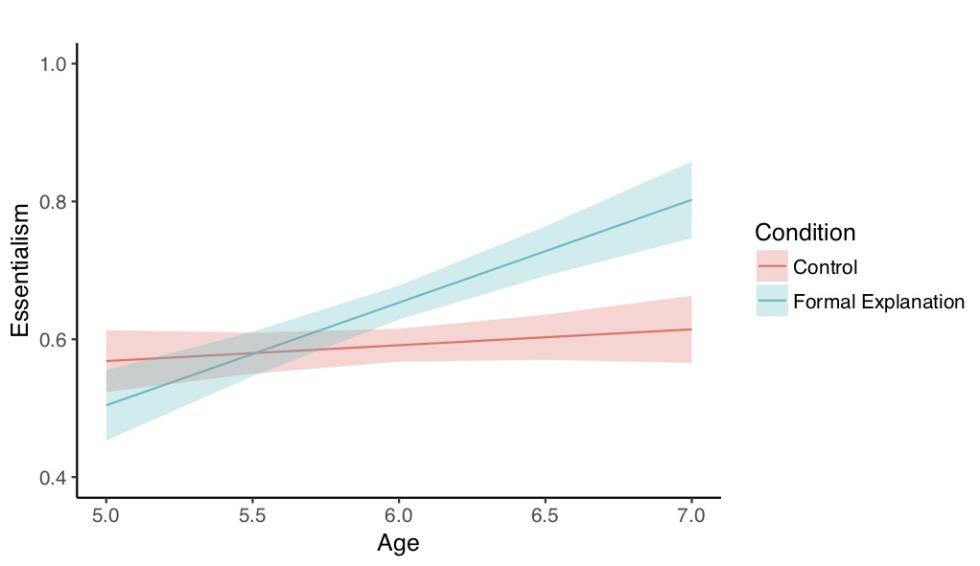
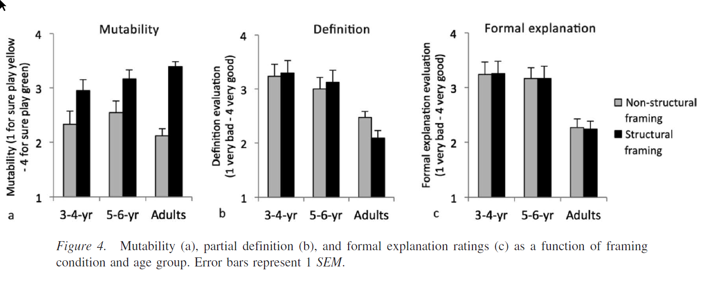

```{r "knitr config", cache = FALSE}
require("knitr")
```


```{r setup}
#### Load relevant libraries and functions
library(tidyverse)
library(broom)
library(paramtest) # power analysis
```

## Introduction

Universally, people impose structure on the world by grouping individual things into categories. Categorization is a universal and powerful cognitive tool that allows us to group various individual things together and treat the individuals as the same in some respect. Our ability to categorize allows us to generalize beyond our immediate experience as to make inductive inferences about other category members we have never experienced. 

The way we represent many categories is shaped by psychological essentialism, the belief that category members share an innate, internal, and unchangeable "essence" that causes them to be fundamentally similar to each other and different from non-category members, and that gives rise to shared obvious and non-obvious properties (Gelman 2003). As a result, certain categories are construed as representing real distinctions in the world. For an example, an essentialist conception of gender might hold that men and women have different essences that make men all alike in some respect, women all alike in some respect, and men and women different from each other. Moreover, these essences are thought to remain unchanging and stable over time, such that men will always be men, and will always be characterized by certain properties, and that women will always be women, and will always be characterized by certain other properties. Essentialism is psychologically powerful, since it facilitates inferences across an entire category to category members that you have never experienced before. Essentialism enables one to infer that other category members will possess the same essence, that they will be similar to members you have seen and dissimilar from non-category members, and that they will possess certain obvious and non-obvious properties. 

Although psychologically powerful and pervasive, essentialism is a cognitive heuristic that can lead to pernicious consequences, especially in the social domain, where it can lead to stereotyping and prejudice (Haslam, Rothschild, Ernst, 2002). Essentialism about gender leads to the belief that gender is a biologically fixed, unchangeable category with strictly defined boundaries, and are associated with prejudice against gay and transgender people.
Essentialism has been widely documented in both children and adults in both biological and social domains (Gelman 2003). However, there is substantial cultural variation in what particular social categories are essentialized. For an example, essentialism about race differs across communities within the United States (Rhodes & Gelman 2009). Cultural variation in what categories are essentialized suggests that essentialism is the product of a general cognitive heuristic towards essentialism and social cues about what categories to essentialize. In particular, subtle cues in language that guide children to essentialized particular categories have been a topic of much research in the field. 

One type of linguistic cue for essentialism is generic statements, such as "girls play with dolls" or "a girl plays with dolls", which have been shown to elicit essentialism in both biological and social domains (Gelman et al., 2010; Rhodes, Leslie, Tworek, 2012). There is not a single syntactic marker that reliably indicates that a statement is generic - rather, whether a statement is interpreted generically involves a combination of morphosyntactic cues, background knowledge about the predicate and the category, and the physical and social context (Cimpian & Markman, 2008; Cimpian, Meltzer, & Markman, 2011). A generic statement elicits essentialism by suggesting that there is a category-based explanation for why the category members have a certain property, and by suggesting that the property is a non-accidental and central property for that category (Cimpian & Markman 2009/2011). 
Recently, formal explanations have been suggested as another cue for essentialism. Formal explanations explain why an individual has a certain property by reference to the category it belongs to, such as "Suzy plays with dolls because Suzy is a girl" (Prasada & Dillingham 2006/2009). Formal explanations explain that an individual has some property because it is a member of a particular category. Formal explanations may be a cue for essentialism, because of two effects that they have. First, formal explanations suggest that property is central to what it means to be a category member, e.g. that playing with dolls is central to what it means to be a girl (Prasada & Dillingham 2006/2009). Second, formal explanations suggest that there is something inherent about being a category member that gives rise to category members possessing that property, e.g. that there is something inherent about being a girl that causes girls to play with dolls (Gelman, Cimpian, Roberts, 2018). As a result, hearing a formal explanation may be a cue to essentialize the category mentioned in the explanation.  

Muradoglu et al 2019 found that formal explanations do indeed boost essentialism for known animal categories, and perhaps for gender as well. Muradoglu et al, submitted contains two studies, one about animal categories, and the other about gender categories. In the first study about animal categories, 5 and 6-year-olds either heard a formal explanation of a novel behavioral property of a known animal category (e.g. "It likes to sleep standing up. because it's a giraffe"), or a control statement (e.g. "It's a giraffe. and it likes to sleep standing up."). Participants then were measured on 3 measures of essentialism: stability over time, mutability, and inductive potential. In the first study about animal categories, there was a main effect of explanation, such that 5 and 6-year-olds who heard the formal explanation had higher measures of essentialism than those who heard the control statement. The second study was similar to the first, but involved gender categories. 5 and 6-year olds either heard a formal explanation of a novel behavioral property of a certain gender (e.g. "Margaret likes to eat gooseberries because she is a girl."), or a control statement (e.g. "Margaret is a girl, and she likes to eat gooseberries."), before being tested on the same 3 measures of essentialism. Contrary to expectations, there was no main effect of explanation. There was an unanticipated interaction between explanation and age, such that the 6-year-olds who heard the formal explanation had higher essentialism measures than the 6-year-olds who heard the control statement, and the 5-year-olds had the same measure of essentialism for both explanations. Muradoglu et al conclude that formal explanations may be a cue for essentialism at age 5 for animal categories and starting at age 6 for gender. 

Do formal explanations always cue essentialism? Previous studies have suggested that formal explanations always yield an intrinsic essentialist interpretation - formal explanations suggest that there is something inherent about being a category member that gives rise to the property (Gelman, Cimpian, Roberts, 2018), or uniquely identify properties that are central to what it means to be a category member (Prasada & Dillingham, 2009). 

However, sometimes formal explanations seem to yield not an essentialist interpretation, but a structural interpretation. For example, "Smith changed her last name after she got married because she's a woman" and "I walk in groups late at night because I'm a woman", are formal explanations that sound apt and natural, yet we do not infer that there is something intrinsic about being a woman that caused Smith to change her last name, or that causes the speaker to walk in groups late at night. Rather, these formal explanations seem to highlight that there structural factors at play. Structural factors are stable extrinsic factors that act on a category by virtue of where the category is situated within a larger structure (Haslanger, 2016). For an example, these formal explanations highlight that there are stable social attitudes that women in our society face, which are due to the role women occupy in society, rather than something inherent or essential about women themselves. As a result, formal explanations may sometimes be interpreted as an expression of structural factors acting on a category, rather than something inherent or essential about a category. 

Can the presence of structural factors in the situation block the essentialist effects of a formal explanation? A study that could address this question would manipulate the presence of structural factors in the situation and examine whether that modulates the effect of formal explanations on essentialism. In other words, the study would be a 2x2 study with two independent variables: the presence or absence of structural factors, and a formal explanation or a control statement, and one dependent variable: a measure of essentialism, such as mutability. If structural factors block the essentialist effects of a formal explanation, the essentialism-boosting effects of hearing a formal explanation should be observed in the non-structural condition, but not in the structural condition. 

A study that comes close to but does not directly address the target question is Vasilyeva, Gopnik, Lombrozo 2018. Vasilyeva et al 2018 found that children and adults can reason about structural factors, and that they judge a formal explanation to be equally apt in a situation with structural factors versus in a neutral situation without structural factors where an essentialist interpretation is more likely. The paradigm they used involved a fictional school with gender-segregated classrooms, where students decide what game to play at recess by tossing a pebble into one of two buckets in their classroom. Most girls play one game, and most boys play another. In the structural condition, the bucket sizes are skewed between the boys' classroom and the girls' classroom, which could provide a structural explanation for why different genders play different games. In the nonstructural condition, the bucket sizes are equal between classrooms, which suggests that different genders might have different inherent preferences for games, and thus play different games. Vasilyeva et al 2018 then had the participants complete a number of tasks, including a formal explanation rating task, in which children and adults rated how good of an explanation a formal explanation was (e.g. "Suzy plays Yellow-Ball because Suzy is a girl"), and a mutability task, which is a measure of essentialism (e.g. Suzy's parents move her to the boys' classroom - which game do you think Suzy will play?). Interestingly, children and adults rated the formal explanation as apt regardless of which condition they were in, which suggests that formal explanations may be amenable to a structural rather than inherent explanation. Children and adults also showed higher mutability, that is, lower essentialism, in the structural condition than in the nonstructural condition, which suggests that the presence of structural factors in the situation blocked them from otherwise forming essentialist beliefs about gender. 

Vasilyeva et al 2018 provides an excellent structural versus nonstructural paradigm for addressing my target question, but does not directly address the issue for two reasons. Firstly, Vasilyeva et al 2018 used a formal explanation rating task, where children and adults were asked to judge a puppet's formal explanation as a good explanation or not. The rating task provides a measure of how apt the formal explanation is, but does not equate to providing the explanation as information about the category to the participants, as we would like to do in this study. Secondly, Vasilyeva et al 2018 was designed to separately address the questions of how structural situations impact the aptness of a formal explanation, and how structural situations impact essentialism, but does not provide evidence as to how structural situations interact with a formal explanation as to impact essentialism. This study takes Vasilyeva et al 2018 as a starting point, but aims to directly address whether structural situations can block the essentialist effects of a formal explanation. 

This study adapts the structural versus nonstructural paradigm from Vasilyeva et al 2018 and the formal explanation versus control statement paradigm from Muradoglu et al submitted in order to address whether structural situations can block the essentialism that would typically result from hearing a formal explanation. In this study, 5 and 6-year-olds will be introduced to the same gender-segregated classroom paradigm as from Vasilyeva et al 2018, hear a formal explanation (e.g. "Suzy plays Yellow-Ball because she is a girl") or control statement adapted from Muradoglu et al to the gender-segregated paradigm, and then will complete a mutability task as a measure of essentialism. If structural situations do block the essentialist effects of a formal explanation, there should be an interaction between situation and explanation, such that formal explanations relative to the control statement should boost essentialism (i.e. depress mutability) in the nonstructural condition, but that boost should be reduced or eliminated in the structural condition. If structural situations fail to block the essentialist effects of a formal explanation, there should only be a main effect of explanation, such that formal explanations relative to the control statement boost essentialism (i.e. depress mutability) in both structural and nonstructural conditions. 

This project's [repository](https://github.com/mariannazhang/structuralblocking) and [preregistration](https://osf.io/7ja86/) can be found online. 


## Methods


### Power Analysis
Prior studies on the main effect of formal explanation and the main effect of structural context on essentialism have used n=46 per cell (n=93 total in Muradoglu et al 2019 Exp 2) or n=24 per cell (n=48 total in Vasilyeva et al 2018). 

Muradoglu et al 2019 (Exp 2 on gender) ran 93 5-6yo in either a formal explanation or control explanation condition (both basically nonstructural), and measured essentialism using 5 essentialism DVs (stability_past, stability_future, innateness_stop, innateness_switch as 0 to 1, and inductive_potential as 0, 0.5, or 1, with greater being more essentialist).

> Although the main effect of condition was not significant, p = .11, the condition by age interaction was, p = .044. Six-year-olds, but not 5-year olds, showed higher essentialism for properties introduced via formal explanations (ps = .011 and .999, respectively; see Figure 2). Children also gave more essentialist responses with age, p = .003.



Vasilyeva et al 2018 ran 48 5-6yo, along with some 4-5yo and adults in either a structural context or nonstructural context, and measured essentialism using 1 essentialism DV (innateness_switch, which they call mutability, coded as 1, 2, 3, 4, with greater being less essentialist). 

> an ANOVA with framing condition and age group as between-subjects factors revealed the predicted main effect of framing, F(1, 85) = 8.95, p = .004, partial_eta_p_sq = .095, with no main effect of age group, F(1, 85) = 1.05, p = .309, nor interaction, F(1, 85) = .01, p = .984. Similarly, adults rated the target property as more mutable under the structural than nonstructural framing, t(65) = 8.04, p = .001, d = 2.00.




```{r power-analysis-kids-1}
# make reproducible
set.seed(1)

# set predicted values based on prior literature
df.predicted <- tibble(
  context = rep(c("nonstructural", "structural"), each = 2),
  explanation = rep(c("control", "formal"), 2),
  
  # means
  essentialism = c(0.590, # nonstructural control ~ Muradoglu et al control condition (exact mean from data), also Vasilyeva et al structural condition (2.5417 out of 1 to 4 reversed scale = 1-(2.5417-1)/(4-1) = 0.49)
                   0.645, # nonstructural formal ~ Muradoglu et al formal condition (exact mean from data)
                   1-(3.1667-1)/(4-1), # structural control ~ Vasilyeva et al structural condition (3.1667 out of 1 to 4 reversed scale = 1-(3.1667-1)/(4-1) = 0.28)
                   1-(3.1667-1)/(4-1)), # structural formal ~ we predict to be the same as structural control = 0.28
  
  sd = c(0.158, # nonstructural control ~ Muradoglu et al control condition (exact SD from average of 5 items, varying from 2-point to 3-point), also Vasilyeva et al structural condition = (0.21685)/(4-1) = (SD = SE * sqrt(n))
         0.187, # nonstructural formal ~ Muradoglu et al formal condition (exact SD from average of 5 items, varying from 2-point to 3-point)
         0.17, # given our paradigm, expect similar SD to Muradoglu et al?
         0.17),
         # (0.16667)/(4-1)*sqrt(24), # structural control ~ Vasilyeva et al structural condition (SD = SE * sqrt(n)), but SD is large because it's only a single 4-point item per participant
         # (0.16667)/(4-1)*sqrt(24))
  
  se = c(0.023,
         0.028,
         0.026,
         0.026)
         # 0.056,
         # 0.056)
)

# plot predictions
ggplot(df.predicted, aes(x = context, y = essentialism, fill = explanation, color = explanation)) +
  stat_summary(fun.y = "mean",
               position = position_dodge(width = 0.8),
               geom = "point",
               shape = 21,
               color = "black",
               size = 4) +
  scale_fill_brewer(palette = "Set1") +
  scale_y_continuous(limits = c(0, 1))
ggsave("FYP_predicted.png", width = 6.25)
```

```{r power-analysis-kids-2}
# set parameters 
alpha = 0.05
n_simulations = 100
n = seq(176, 200, 8)

# set up the simulation grid 
df.pwr = crossing(sample_size = n,
                  simulation = 1:n_simulations,
                  alpha = alpha)

df.pwr <- df.pwr %>%
  group_by(simulation, sample_size) %>%
  mutate(data = list(
    tibble(
      context = rep(c("nonstructural", "structural"), each = sample_size * 2),
      explanation = rep(c("control", "formal", "control", "formal"), each = sample_size),
      essentialism = c(
        rnorm(sample_size, mean = df.predicted$essentialism[1], sd = df.predicted$sd[1]),
        rnorm(sample_size, mean = df.predicted$essentialism[2], sd = df.predicted$sd[2]),
        rnorm(sample_size, mean = df.predicted$essentialism[3], sd = df.predicted$sd[3]),
        rnorm(sample_size, mean = df.predicted$essentialism[4], sd = df.predicted$sd[4])
      )
    )
  )) %>% 
  mutate(fit = map(data, ~ lm(essentialism ~ context * explanation, data = .)),
         coef = map(fit, tidy)) %>% 
  unnest(coef) %>% 
  filter(term == "contextstructural:explanationformal") %>% 
  group_by(sample_size) %>% 
  summarize(power = sum(p.value < .05) / n())
df.pwr

ggplot(df.pwr, aes(x = sample_size, y = power)) +
  geom_line() +
  geom_line(y = 0.8, linetype = "dashed") +
  scale_y_continuous(limits = c(0, 1))

```

We chose to run n=184 5-6yo and n=184 adults, which is n=46 in each cell of this 2x2 experimental design. We chose n=184 for each age group because n=46 per cell was the maximum sample size used in prior studies, and because n=46 per cell was suitable given resource constraints. 

By running our target analysis on simulated data (based on results from prior studies and our own predictions), we found that n=184 should yield `r df.pwr$power[2] * 100`% power. 

### Planned Sample

<!-- Planned sample size and/or termination rule, sampling frame, known demographics if any, preselection rules if any.-->

Planned sample size is n=184 5- and 6-year-olds recruited from a university preschool and museums, and n=184 adults recruited on Amazon Mechanical Turk. MTurk participants will be required to be located within the United States, and will be required to have a HIT acceptance rate of 80% or above. MTurk participants will be paid 60 cents (5 minutes * 7.25/hr federal minimum wage). 

### Materials
The PowerPoint materials presented to children can be found on the github repo under materials. The adult survey paradigm can be found on Qualtrics.


### Procedure	
Participants will be shown a storybook adapted from Vasilyeva, Lombrozo, & Gopnik, 2018 presented in PowerPoint slideshow format on a laptop display. Two between-subjects variables will be manipulated, resulting in a 2x2 design: context (structural vs non-structural) and explanation (formal explanation vs control statement). Participants will be randomly assigned to one of the total 4 conditions. 

The storybook describes a fictional school with gender-segregated classrooms, where children decide what game to play at recess by tossing a pebble into one of two buckets in their classroom: a yellow bucket and a green bucket. If a child tosses a pebble into the yellow bucket, they will play Yellow-Ball. If a child tosses a pebble into the green bucket, they will play Green-Ball. In the structural condition, the buckets are of unequal sizes in each classroom. In the girls' classroom, the yellow bucket is much larger than the green bucket, and in the boys' classroom, the green bucket is much larger than the yellow bucket. It is thus much easier to throw the pebble into the yellow bucket in the girls' classroom, and into the green bucket in the boys' classroom. In the non-structural condition, the buckets are of equal sizes in each classroom. It is thus of equal difficulty to throw the pebble into either bucket in either classroom. All participants then see statistical evidence that in the girls' classroom, the majority of girls throw their pebble into yellow bucket, and thus play Yellow-Ball, and that in the boys' classroom, the majority of boys throw their pebble into the green bucket, and thus play Green-Ball. A series of memory checks confirm that the participants remember the gender-segregation of the classrooms, the size of the buckets in each classroom, and the statistical evidence for what games girls and boys play. 

The explanation manipulation was adapted from Muradoglu et al, 2019 All participants are introduced to a girl called Suzy. In the formal explanation condition, participants are given a formal explanation for why Suzy plays Yellow-Ball ("Here's Suzy. Suzy plays Yellow-Ball because she is a girl."). In the control statement condition, participants are given a control statement that does not constitute a formal explanation ("Here's Suzy. She is a girl. She plays Yellow-Ball."). Note that this manipulation differs from the formal explanation evaluation task in Vasilyeva et al, 2018, in that this manipulation directly provides an explanation to the participant, whereas the evaluation task presents a possible explanation to be evaluated as a good explanation or not by the participant.

Based on pilot results, there will be 3 essentialism measures that will be averaged into an average essentialism measure per subject: a force choice item between preference or structural explanations, a 4-point inductive potential item, and a 4-point innateness item based on a switched-at-birth scenario (this last item taken from Vasilyeva et al 2019). A measure of group normativity will also be collected and explored as a follow-up measure. 


### Analysis Plan

<!-- data cleaning rules, data exclusion rules, covariates, etc. Key analysis of interest. Can also pre-specify additional analyses you plan to do.-->


#### Exclusion criteria
Child participants will be excluded for experimenter error, insufficient English language skills, parental interference, or failing to complete the task. Adult participants will be excluded for failing the game comprehension check, or the attention check. 

#### Analysis of interest
The analysis of interest will be an ANOVA on subjects' essentialism measures with an interaction term for context and explanation. 

We predict an interaction between context and explanation, such that in the nonstructural condition, hearing a formal explanation relative to a control explanation increases essentialism, but in the structural condition, hearing a formal explanation relative to a control explanation increases essentialism to a lesser extent or does not increase essentialism compared to the nonstructural condition. In other words, the formal explanation may be interpreted structurally, and an essentialist reading blocked in the structural condition. 


### Methods Addendum (Post Data Collection)
#### Actual Sample
<!-- actual sample size, actual power, exclusions, demographics -->

We ran n=200 adults, aiming to retain the target sample size of n=184 after exclusion criteria. After exclusion criteria, we retained n=`r n.adults`.


#### Differences from pre-data collection methods plan


## Results


### Data preparation

Data preparation as specified in the analysis plan.

```{r import-data}
#### Import data for analysis
df.data.adults <- read_csv("../data/FYP_data_adults.csv")
df.data.children <- read_csv("../data/FYP_data_children.csv")
```

```{r adults-clean}
# Filter out those who didn't consent
df.data.adults <- df.data.adults %>%
  filter(Consent == "I do consent to participate") %>% 
  select(-Consent)

# Add subject ID and location
df.data.adults <- df.data.adults %>% 
  mutate(subject = row_number(),
         location = "MTurk")

# Coalesce redundant columns
df.data.adults <- df.data.adults %>% 
  mutate(check_bucket_boy = coalesce(check_bucket_boy_1, check_bucket_boy_2, check_bucket_boy_3),
         check_bucket_girl = coalesce(check_bucket_girl_1, check_bucket_girl_2, check_bucket_girl_3),
         check_sample_boy = coalesce(check_sample_boy_1, check_sample_boy_2),
         check_sample_girl = coalesce(check_sample_girl_1, check_sample_girl_2),
         fc_expl_indiv = coalesce(fc_expl_indiv_1, fc_expl_indiv_2, fc_expl_indiv_3, fc_expl_indiv_4),
         normative_group = coalesce(normative_group_1, normative_group_2),
         inductivePoten = coalesce(inductivePoten_1, inductivePoten_2),
         innateness_switch = coalesce(innateness_switch_1, innateness_switch_2),
         check_attn = coalesce(check_attn_1, check_attn_2))

# Keep columns we care about
df.data.adults <- df.data.adults %>% 
  select(RecordedDate,
         subject, 
         location,
         context, explanation, cb,
         check_game,
         check_bucket_boy, check_bucket_girl,
         check_sample_boy, check_sample_girl,
         fc_expl_indiv, normative_group, inductivePoten, innateness_switch,
         check_attn,
         age:ed) %>% 
  rename(test_date = RecordedDate)

# Remove line breaks in responses
df.data.adults$inductivePoten <- df.data.adults$inductivePoten %>% 
  str_replace_all("\n", " ")
df.data.adults$innateness_switch <- df.data.adults$innateness_switch %>% 
  str_replace_all("\n", " ")
df.data.adults$check_attn <- df.data.adults$check_attn %>% 
  str_replace_all("\n", " ")

# Convert gender to lowercase to match kids dataframe
df.data.adults$gender <- df.data.adults$gender %>% 
  str_to_lower()

# Convert age to number
df.data.adults$age <- df.data.adults$age %>% 
  as.numeric()
```

```{r kids-clean}
# Keep columns we care about
df.data.children <- df.data.children %>% 
  select(-file, -bing_id, -stim)
```


```{r exclusion}
#### Data exclusion / filtering
# Record exclusions: experimentor error, age
df.excl.children <- df.data.children %>%
  summarize(atypical = sum(atypical == "yes"),
            insuff_lang = sum(insuff_lang == "yes"),
            exp_error = sum(exp_error == "yes"),
            interference = sum(interference == "yes"))
  
df.excl.adults <- df.data.adults %>% 
  summarize(check_game = sum(check_game == "No"),
            check_attn = sum(check_attn != "For sure Yellow-Ball"))


# Exclude subjects and remove exclusion columns
df.data.children <- df.data.children %>%
  filter(atypical == "no",
         insuff_lang == "no",
         exp_error == "no",
         interference == "no") %>%
  select(-atypical, -insuff_lang, -exp_error, -interference)

df.data.adults <- df.data.adults %>% 
  filter(check_game == "Yes" & 
           check_attn == "For sure Yellow-Ball") %>% 
  select(-check_attn)
  
```

```{r sample-size}
n.adults <- nrow(df.data.adults)
n.children <- nrow(df.data.children)
```

```{r combine-data}
df.data <- bind_rows(df.data.adults, df.data.children)
```

```{r dem}
#### Demographics
# Add age categorical variable
df.data <- df.data %>% 
  mutate(age_cat = case_when(
    age >= 5 & age < 6 ~ "5",
    age >= 6 & age < 7 ~ "6",
    age >= 18 ~ "adult")) %>% 
  mutate(age_group = case_when(
    age < 7 ~ "child",
    age >= 18 ~ "adult"))
df.data$age_group <- df.data$age_group %>% 
  factor(levels=c('child', 'adult'))

# Age
df.dem_age <- df.data %>%
  count(age_cat)

# Gender
df.dem_gender <- df.data %>%
  count(gender)

# Race
df.dem_race <- df.data %>%
  count(race)

# Ed
df.dem.adults_ed <- df.data.adults %>%
  count(ed)
```


```{r recoding-tidying}
# Recode dependent measures
df.data$fc_expl_indiv <- df.data$fc_expl_indiv %>% 
  recode("Because of the size of the buckets in her classroom" = 0,
         "Because Suzy likes playing Yellow-Ball" = 1,
         "Because Suzy likes playing Green-Ball" = 1)

df.data$inductivePoten <- 
  if_else(df.data$cb == "girlsYellow", 
          (recode(df.data$inductivePoten,
                  "For sure Green-Ball" = 0,
                  "Maybe Green-Ball" = 1/3,
                  "Maybe Yellow-Ball" = 2/3,
                  "For sure Yellow-Ball" = 1)),
          (recode(df.data$inductivePoten,
                  "For sure Yellow-Ball" = 0,
                  "Maybe Yellow-Ball" = 1/3,
                  "Maybe Green-Ball" = 2/3,
                  "For sure Green-Ball" = 1)))

df.data$innateness_switch <- 
  if_else(df.data$cb == "girlsYellow", 
          (recode(df.data$innateness_switch,
                  "For sure Green-Ball" = 0,
                  "Maybe Green-Ball" = 1/3,
                  "Maybe Yellow-Ball" = 2/3,
                  "For sure Yellow-Ball" = 1)),
          (recode(df.data$innateness_switch,
                  "For sure Green-Ball" = 1,
                  "Maybe Green-Ball" = 2/3,
                  "Maybe Yellow-Ball" = 1/3,
                  "For sure Yellow-Ball" = 0)))

df.data$normative_group <- df.data$normative_group %>% 
  recode("Okay" = 0,
         "Not okay" = 1)


# Gather to tidy long form
df.tidy <- df.data %>% 
  select(-starts_with("check"), -ends_with("expl")) %>% 
  gather(question, response, "fc_expl_indiv":"innateness_switch")


# Order questions
df.tidy$question <- df.tidy$question %>% 
  factor(levels=c('fc_expl_indiv', 'inductivePoten', 'innateness_switch', 'normative_group'))


# Calculate overall essentialism measure per subject
df.subj <- df.tidy %>% 
  filter(!str_detect(question, "normative")) %>% 
  group_by(subject, age, age_cat, age_group, gender, context, explanation) %>% 
  summarize(essentialism = mean(response, na.rm = TRUE))

df.subj.children <- df.tidy %>% 
  filter(!str_detect(question, "normative")) %>% 
  filter(age_group == "child") %>% 
  group_by(subject, age, age_cat, gender, context, explanation) %>% 
  summarize(essentialism = mean(response, na.rm = TRUE))

df.subj.adults <- df.tidy %>% 
  filter(!str_detect(question, "normative")) %>% 
  filter(age_group == "adult") %>% 
  group_by(subject, context, gender, explanation) %>% 
  summarize(essentialism = mean(response, na.rm = TRUE))
```

### Descriptive analysis
```{r}
# Overall essentialism measure across subjects by condition
df.means.adults <- df.subj.adults %>%
  group_by(context, explanation) %>% 
  summarize(avg = mean(essentialism, na.rm = TRUE),
            sd = sd(essentialism, na.rm = TRUE), 
            n = length(unique(subject)))
df.means.adults

df.means.children <- df.subj.children %>%
  group_by(context, explanation) %>% 
  summarize(avg = mean(essentialism, na.rm = TRUE),
            sd = sd(essentialism, na.rm = TRUE), 
            n = length(unique(subject)))
df.means.children
```

```{r}
# Set visualization theme
theme_set(
  ggthemes::theme_few() +
  theme(text = element_text(size = 16)) # large text size for presentation figures
)
```

```{r vis-all}
# essentialism by context and explanation, facet by age_group
ggplot(df.subj, aes(x = context, y = essentialism, fill = explanation, color = explanation)) +
  facet_wrap(vars(age_group)) +
  geom_point(position = position_jitterdodge(jitter.width = 0.2, dodge.width = 0.8),
             alpha = 0.3) + 
  stat_summary(fun.data = "mean_cl_boot",
               position = position_dodge(width = 0.8),
               geom = "linerange",
               size = 1) +
  stat_summary(fun.y = "mean",
               position = position_dodge(width = 0.8),
               geom = "point",
               shape = 21,
               color = "black",
               size = 4) +
  scale_fill_brewer(palette = "Set1") +
  scale_y_continuous(limits = c(0, 1))
ggsave("FYP_contextExpl.png", width = 10)

```

### Target analysis

The analyses as specified in the analysis plan. 

```{r anova}
# fit.compact <- lm(essentialism ~ 1 + context + explanation, data = df.subj.children)
# fit.aug <- lm(essentialism ~ 1 + context * explanation, data = df.subj.children)
# contextExplInt.children <- anova(fit.compact, fit.aug)

aov(essentialism ~ 1 + context * explanation, data = df.subj.adults) %>% 
  summary()

```

### Exploratory analysis
```{r DVs}
# DVs by context and explanation
ggplot(df.tidy %>%  filter(age_group == "adult"), aes(x = context, y = response, fill = explanation, color = explanation)) +
  facet_wrap(vars(question)) +
  geom_point(position = position_jitterdodge(jitter.width = 0.2, jitter.height = 0.02, dodge.width = 0.8),
             alpha = 0.3) + 
  stat_summary(fun.data = "mean_cl_boot",
               position = position_dodge(width = 0.8),
               geom = "linerange",
               size = 1) +
  stat_summary(fun.y = "mean",
               position = position_dodge(width = 0.8),
               geom = "point",
               shape = 21,
               color = "black",
               size = 4) +
  scale_fill_brewer(palette = "Set1") +
  scale_y_continuous(limits = c(0, 1))
ggsave("FYP_contextExpl_DV_adult.png", width = 10)
```

```{r normative}
# Normative by context and explanation
ggplot(df.tidy %>%  filter(question == "normative_group"), aes(x = context, y = response, fill = explanation, color = explanation)) +
  facet_wrap(vars(age_group)) +
  geom_point(position = position_jitterdodge(jitter.width = 0.2, jitter.height = 0.02, dodge.width = 0.8),
             alpha = 0.3) + 
  stat_summary(fun.data = "mean_cl_boot",
               position = position_dodge(width = 0.8),
               geom = "linerange",
               size = 1) +
  stat_summary(fun.y = "mean",
               position = position_dodge(width = 0.8),
               geom = "point",
               shape = 21,
               color = "black",
               size = 4) +
  scale_fill_brewer(palette = "Set1") +
  scale_y_continuous(limits = c(0, 1))
ggsave("FYP_contextExpl_normative.png", width = 10)


# Normative by context and explanation (adults)
ggplot(df.tidy %>%  filter(age_group == "adult", question == "normative_group"), aes(x = context, y = response, fill = explanation, color = explanation)) +
  geom_point(position = position_jitterdodge(jitter.width = 0.2, jitter.height = 0.02, dodge.width = 0.8),
             alpha = 0.3) + 
  stat_summary(fun.data = "mean_cl_boot",
               position = position_dodge(width = 0.8),
               geom = "linerange",
               size = 1) +
  stat_summary(fun.y = "mean",
               position = position_dodge(width = 0.8),
               geom = "point",
               shape = 21,
               color = "black",
               size = 4) +
  scale_fill_brewer(palette = "Set1") +
  scale_y_continuous(limits = c(0, 1))
ggsave("FYP_contextExpl_normative_adult.png", width = 10)


# Normative by context and explanation (child)
ggplot(df.tidy %>%  filter(age_group == "child"), aes(x = context, y = response, fill = explanation, color = explanation)) +
  facet_wrap(vars(question)) +
  geom_point(position = position_jitterdodge(jitter.width = 0.2, jitter.height = 0.02, dodge.width = 0.8),
             alpha = 0.3) + 
  stat_summary(fun.data = "mean_cl_boot",
               position = position_dodge(width = 0.8),
               geom = "linerange",
               size = 1) +
  stat_summary(fun.y = "mean",
               position = position_dodge(width = 0.8),
               geom = "point",
               shape = 21,
               color = "black",
               size = 4) +
  scale_fill_brewer(palette = "Set1") +
  scale_y_continuous(limits = c(0, 1))
ggsave("FYP_contextExpl_DV_child.png", width = 10)
```

```{r innateness_switch}
# Innateness switch by context and explanation
ggplot(df.tidy %>%  filter(question == "innateness_switch"), aes(x = context, y = response, fill = explanation, color = explanation)) +
  facet_wrap(vars(age_group)) +
  geom_point(position = position_jitterdodge(jitter.width = 0.2, jitter.height = 0.02, dodge.width = 0.8),
             alpha = 0.3) + 
  stat_summary(fun.data = "mean_cl_boot",
               position = position_dodge(width = 0.8),
               geom = "linerange",
               size = 1) +
  stat_summary(fun.y = "mean",
               position = position_dodge(width = 0.8),
               geom = "point",
               shape = 21,
               color = "black",
               size = 4) +
  scale_fill_brewer(palette = "Set1") +
  scale_y_continuous(limits = c(0, 1))
ggsave("FYP_contextExpl_innateness_switch.png", width = 10)
```

```{r subj_gender}
# essentialism by context and explanation, facet by gender and age_group
ggplot(df.subj %>% filter(gender != "prefer not to specify"), aes(x = context, y = essentialism, fill = explanation, color = explanation)) +
  facet_wrap(gender ~ age_group) +
  geom_point(position = position_jitterdodge(jitter.width = 0.2, dodge.width = 0.8),
             alpha = 0.3) + 
  stat_summary(fun.data = "mean_cl_boot",
               position = position_dodge(width = 0.8),
               geom = "linerange",
               size = 1) +
  stat_summary(fun.y = "mean",
               position = position_dodge(width = 0.8),
               geom = "point",
               shape = 21,
               color = "black",
               size = 4) +
  scale_fill_brewer(palette = "Set1") +
  scale_y_continuous(limits = c(0, 1))
ggsave("FYP_contextExpl_gender.png", width = 10)
```

## Discussion


